<p align="center">
    
</p>
<p align="center">
  
  
  <a href="https://edu.nextstep.camp/c/R89PYi5H" alt="nextstep atdd">
    
  </a>
  
</p>

<br>

# 인프라공방 샘플 서비스 - 지하철 노선도

<br>

## 🚀 Getting Started

### Install
#### npm 설치
```
cd frontend
npm install
```
> `frontend` 디렉토리에서 수행해야 합니다.

### Usage
#### webpack server 구동
```
npm run dev
```
#### application 구동
```
./gradlew clean build
```
<br>

## 미션

* 미션 진행 후에 아래 질문의 답을 작성하여 PR을 보내주세요.


### 1단계 - 화면 응답 개선하기
1. 성능 개선 결과를 공유해주세요 (Smoke, Load, Stress 테스트 결과)

- 개선 전 smoke test


- 개선 후 smoke test

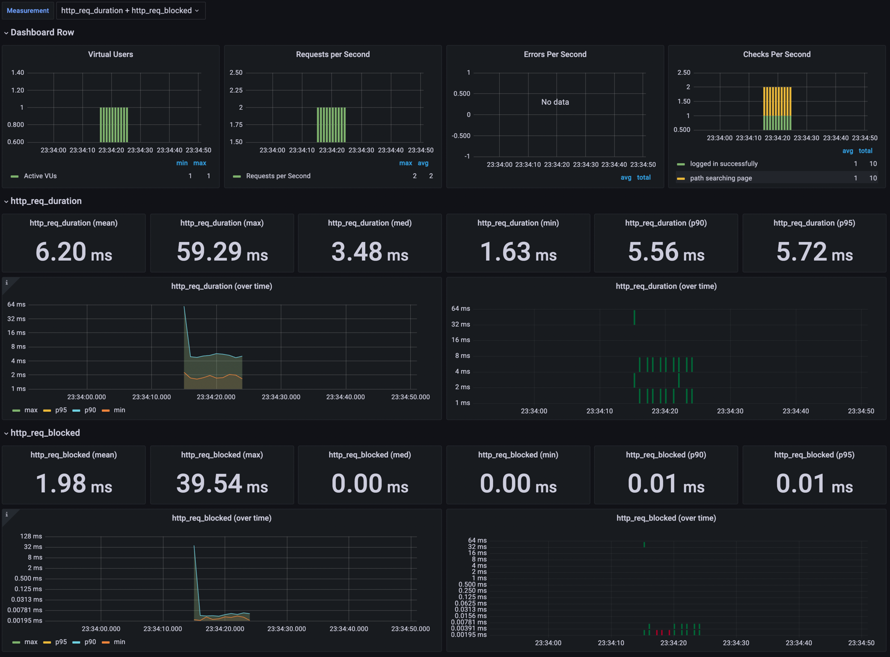

- 개선 전 load test


- 개선 후 load test
  - ms 단위라 테스트 할때마다 차이가 있겠지만.. 조금 늘었다.

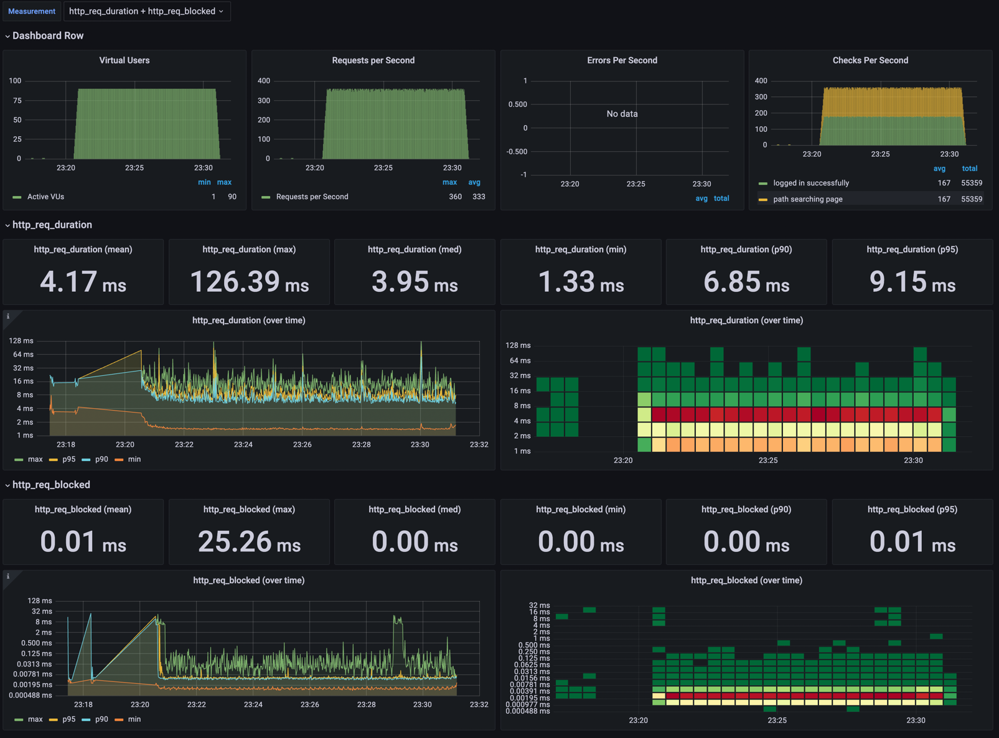

- 개선 전 stress test

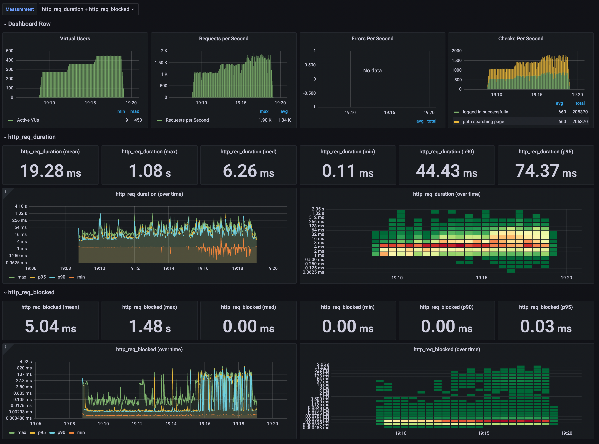

- 개선 후 stress test

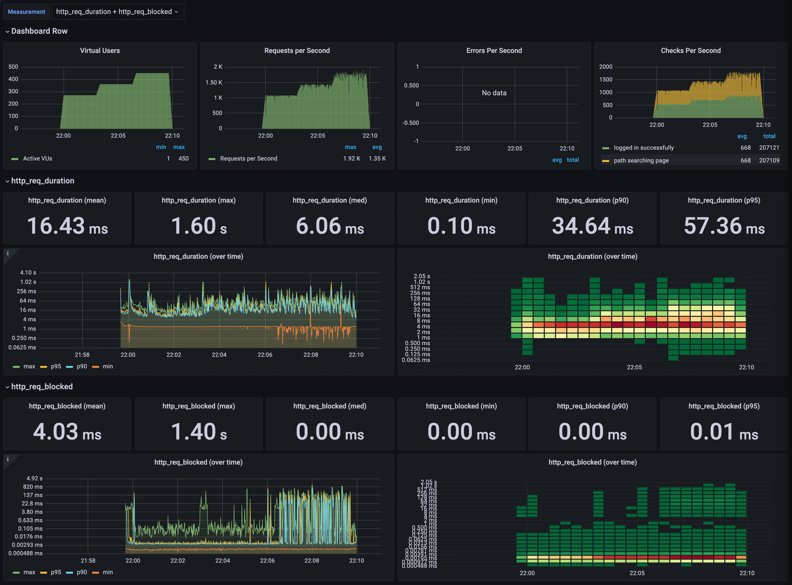

2. 어떤 부분을 개선해보셨나요? 과정을 설명해주세요

> - 최대 부하를 기준으로 개선을 확인해야 한다고 판단하여 stress 테스트로 아래 과정들을 진행했습니다.
> - 지난 미션에서는 90/180/240/360 VUser로 진행했으나 이번에는 240/360/450 VUser로 단계를 높여서 진행했습니다.

- 개선 전 테스트

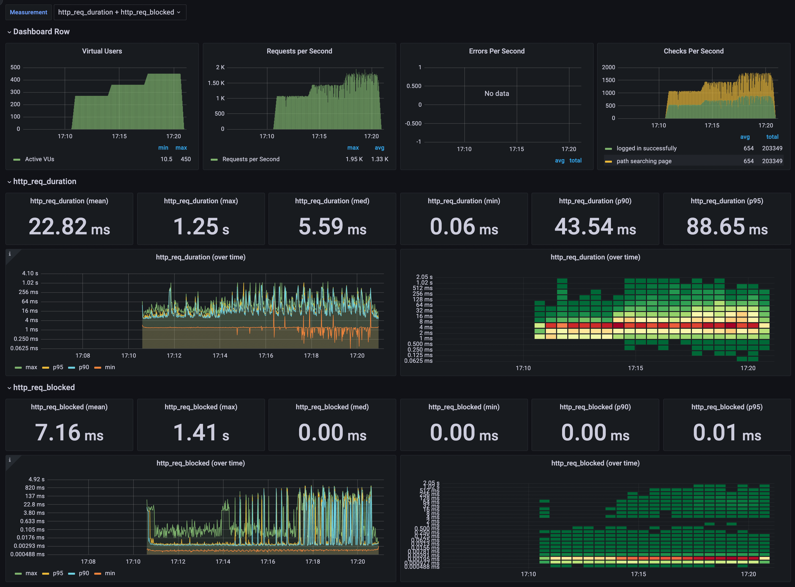

- nginx gzip 압축 적용 후
  - 평균 응답시간이 3.54ms 감소 (18%)
  - 95% 요청 응답시간 경계값이 14.28ms 감소 (19%)


- nginx cache 압축 적용 후
  - 평균 응답속도에서는 개선점이 보이지 않음
  - 중앙값 응답시간이 0.58ms 감소 (10%)
  - 90% 요청 응답시간 경계값이 8.6ms 감소 (24%)
  - 95% 요청 응답시간 경계값이 6.64ms 감소 (9%)

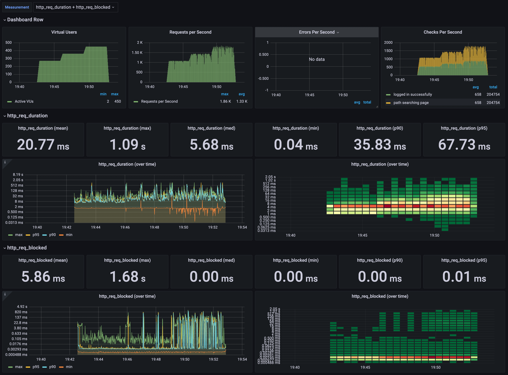

- redis 적용 후
  - 평균 응답시간이 4.34ms 감소 (26%)
  - 95% 요청 응답시간 경계값이 10.37ms 감소 (18%)
  - path searching page에서 간헐적 실패가 나와 올바른 개선 방향인지에 대한 의문


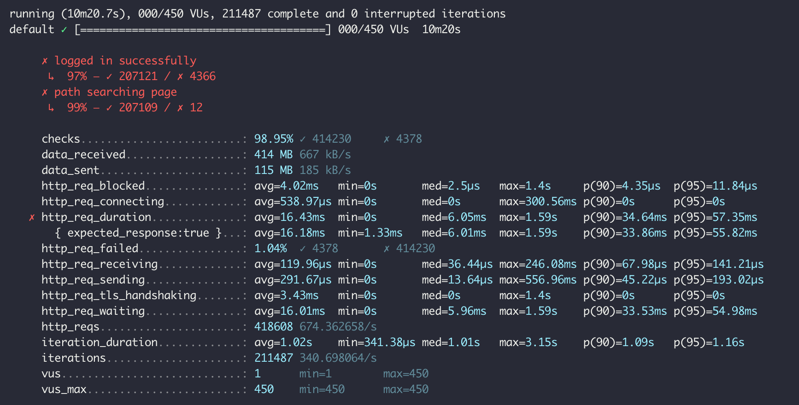

---

### 2단계 - 스케일 아웃

1. Launch Template 링크를 공유해주세요.

```md
https://ap-northeast-2.console.aws.amazon.com/ec2/v2/home?region=ap-northeast-2#LaunchTemplateDetails:launchTemplateId=lt-0d8e6357e247d2373
```

2. cpu 부하 실행 후 EC2 추가생성 결과를 공유해주세요. (Cloudwatch 캡쳐)

```sh
$ stress -c 2
```

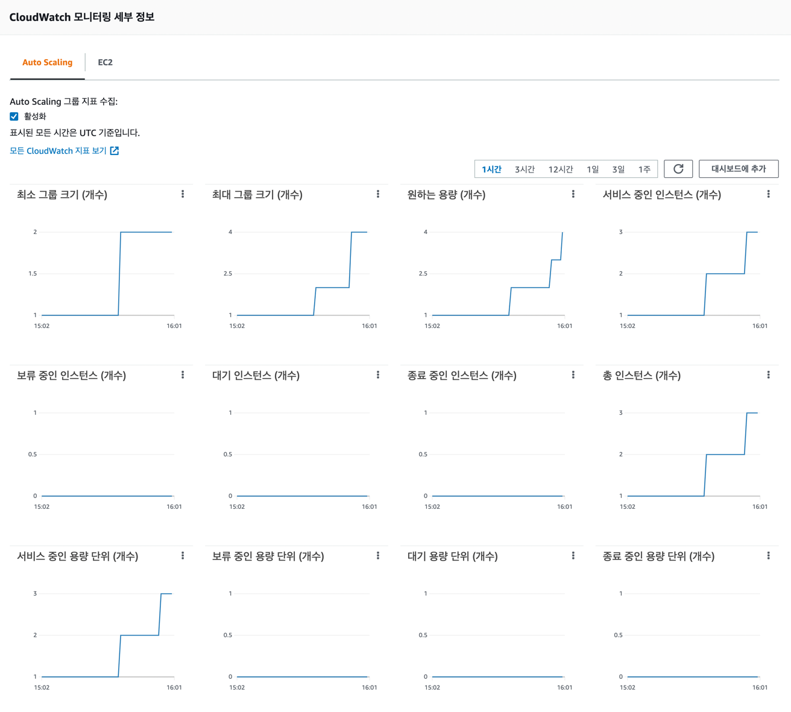

- 원하는 용량 2, 최소 용량 2, 최대 용량 4로 설정 후 1대의 인스턴스에 cpu 부하를 주니 순차적으로 3대, 4대로 증설

3. 성능 개선 결과를 공유해주세요 (Smoke, Load, Stress 테스트 결과)

- smoke test
  - 단일 요청은 더 느려졌다.

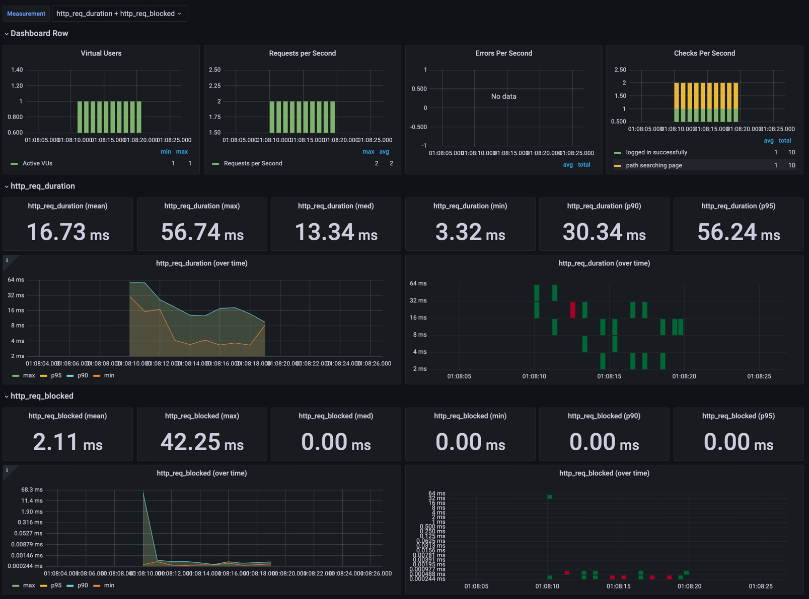

- load test
  - 약간의 개선 보임 (p90, p95)

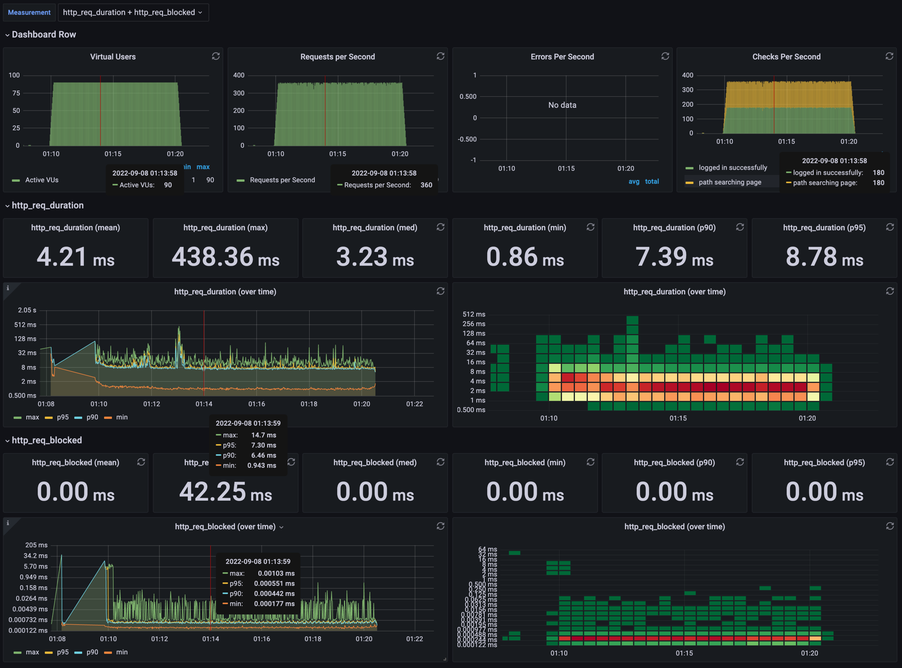

- stress test
  - 상당한 개선
    - 평균 응답시간 11.69ms 감소 (71%)
    - 중앙값 응답시간 2.9ms 감소 (48%)
    - 90% 요청 응답시간 경계값이 26.42ms 감소 (76%)
    - 95% 요청 응답시간 경계값이 45.82ms 감소 (80%)

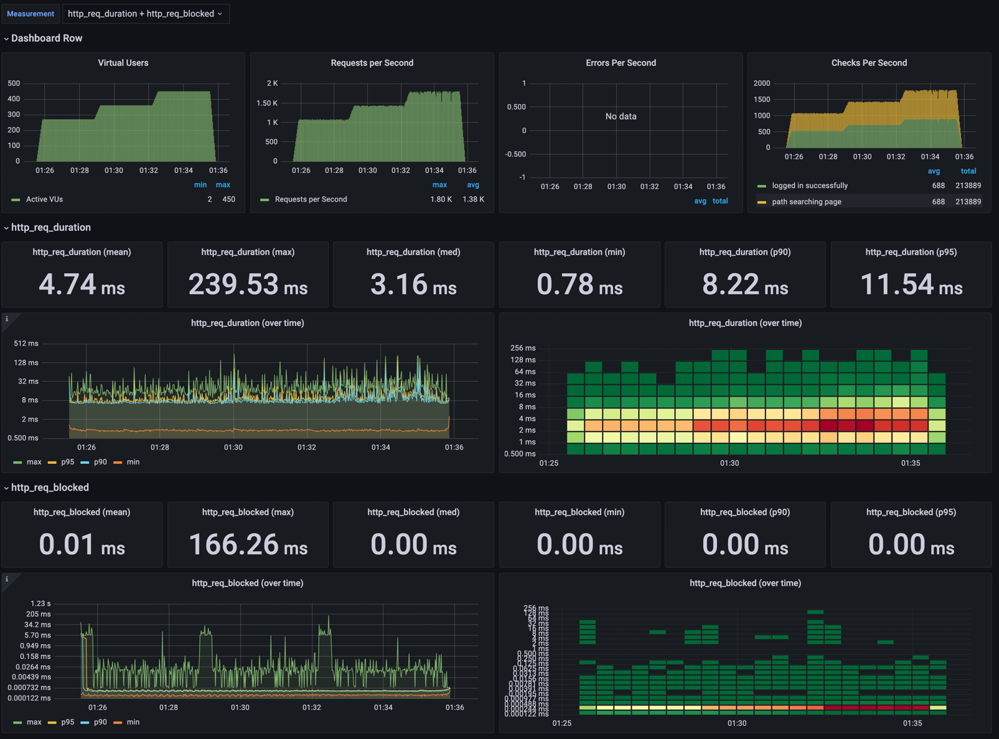


---
### [추가] 1단계 - 쿠버네티스로 구성하기
1. 클러스터를 어떻게 구성했는지 알려주세요~ (마스터 노드 : n 대, 워커 노드 n대)

2. 스트레스 테스트 결과를 공유해주세요 (기존에 container 한대 운영시 한계점도 같이 공유해주세요)

3. 현재 워커노드에서 몇대의 컨테이너를 운영중인지 공유해주세요

---

### [추가] 2단계 - 클러스터 운영하기

1. kibana 링크를 알려주세요

2. grafana 링크를 알려주세요

3. 지하철 노선도는 어느정도로 requests를 설정하는게 적절한가요?

4. t3.large로 구성할 경우 Node의 LimitRange, ResourceQuota는 어느정도로 설정하는게 적절한가요?

5. 부하테스트를 고려해볼 때 Pod은 몇대정도로 구성해두는게 좋다고 생각하나요?

6. Spinaker 링크를 알려주세요.
